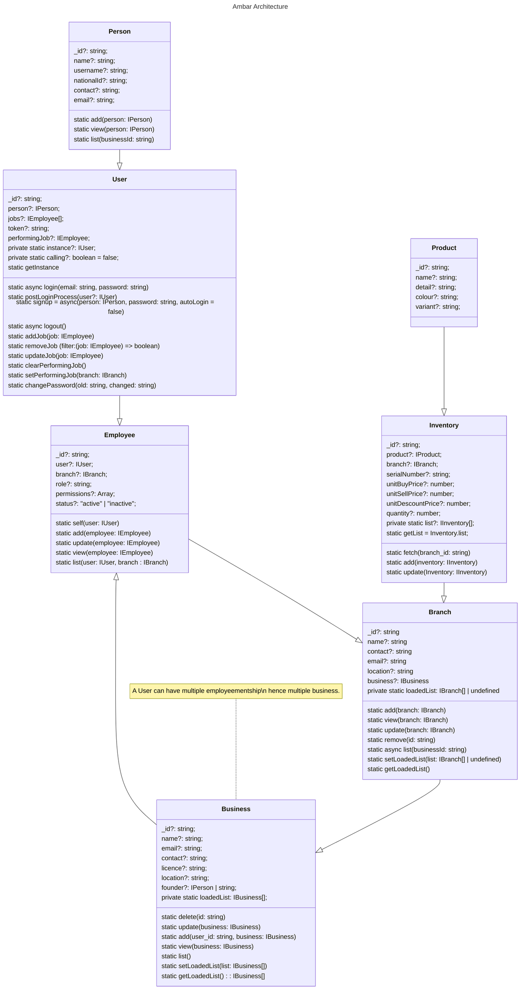

# Introduction
 Ambaar stands at the forefront of innovative solutions, redefining the landscape of inventory and business management. Designed with a singular focus on enhancing financial efficiency, Ambaar is more than just a system—it's a comprehensive tool crafted to streamline the complexities of managing businesses. With an unwavering commitment to excellence, Ambaar empowers organizations to take control of their finances, providing a robust platform that transforms how businesses approach inventory, transactions, and overall financial management. Join the evolution of business management with Ambaar and witness a new era of operational excellence and financial prowess.

## Quick Setup

**Pre Requisites**

- <a href="https://github.com/abdulroufsidhu/ambaar_backend_repo.git" target="_blank">Setup ambaar-backend-repo</a>

**Quick Start**

- run `npm i && npm run dev`

### Project Architecture
> I am no way expret architect and a bad documentor. But I must try my best. This architecture has a lot of room for improvement.
Please feel free to participate in the section of documentation or development.

