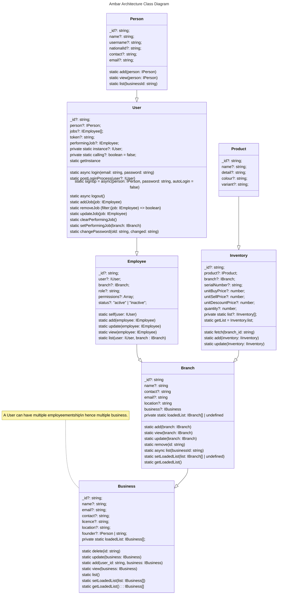
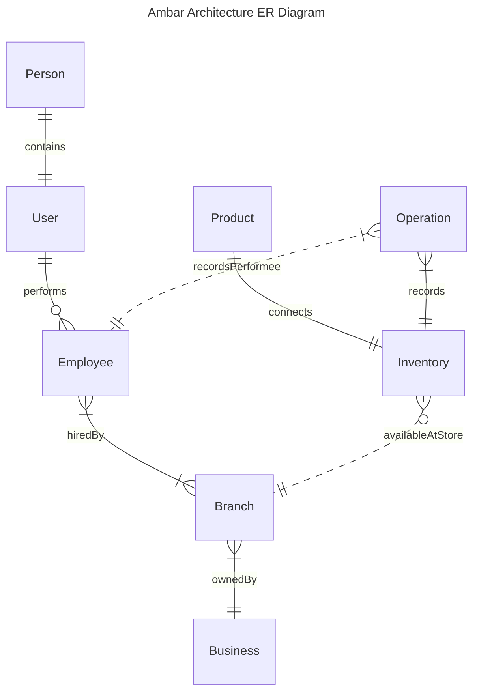

# Models
Models are the classes of typescript to typeguard teh data of several types whole system consists of following modal classes
 1) Person [Source](./person.ts) - [Documentation](../../../docs/models/person.md) 
 2) User [Source](./user.ts) - [Documentation](../../../docs/models/user.md)
 3) Branch [Source](./branch.ts) - [Documentation](../../../docs/models/branch.md)
 4) Business [Source](./business.ts) - [Documentation](../../../docs/models/business.md)
 5) Employee [Source](./employee.ts) - [Documentation](../../../docs/models/employee.md)
 6) Inventory [Source](./inventory.ts) - [Documentation](../../../docs/models/inventory.md)
 7) Operation [Source](./operation.ts) - [Documentation](../../../docs/models/operation.md)
 8) Permission [Source](./permission.ts) - [Documentation](../../../docs/models/permission.md)

Below diagram explains the classes and their relationship

